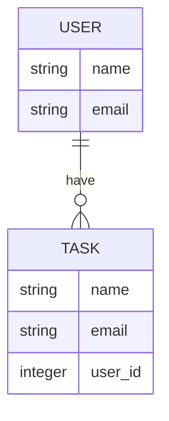

# README


***
# Task

| id | name | content | user_id |
| ---- | ---- | ---- | ---- |
| 1 | 掃除 | 台所を掃除する |1|

***
# User

| id | name | email |
| ---- | ---- | ---- |
| 1 | 加田井助 | kadaitasuku_10000you@xxxxx.com |

***



***

### Herokuへのデプロイ方法

```terminal
heroku login
```

```terminal
heroku create
```

```terminal
heroku buildpacks:set heroku/ruby
```

```terminal
heroku buildpacks:add --index 1 heroku/nodejs
```

```terminal
heroku apps:info
```

```terminal
=== young-inlet-46537
Auto Cert Mgmt: false
Dynos:
Git URL:        https://git.heroku.com/young-inlet-46537.git
Owner:          shoshi100010000@gmail.com
Region:         us
Repo Size:      0 B
Slug Size:      0 B
Stack:          heroku-22
Web URL:        https://young-inlet-46537.herokuapp.com/
```

```terminal
heroku stack:set heroku-20
```

```terminal
heroku apps:info
```

```terminal
=== young-inlet-46537
Auto Cert Mgmt: false
Dynos:
Git URL:        https://git.heroku.com/young-inlet-46537.git
Owner:          shoshi100010000@gmail.com
Region:         us
Repo Size:      0 B
Slug Size:      0 B
Stack:          heroku-20
Web URL:        https://young-inlet-46537.herokuapp.com/
```

```terminal
git add . && git commit -m "message"
```

```terminal
git push heroku step2:master
```

```terminal
heroku run rails db:migrate
```

